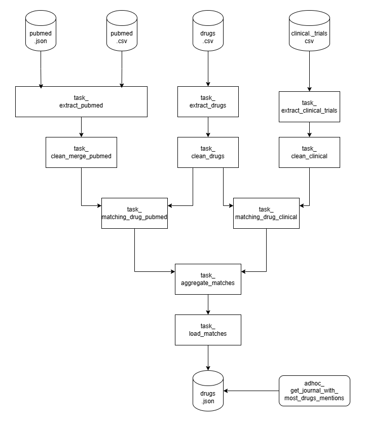
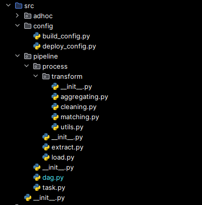
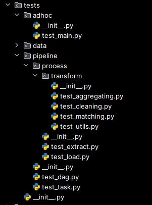

# 💊 Drug Data Pipeline

This repository implements a **data processing pipeline** focused on drug-related data from various sources.
It provides the following:

- A **Prefect-based data pipeline** to extract, clean, and match drug mentions from multiple publication sources.
- **Ad-hoc scripts** for analyzing pipeline results.
- **SQL scripts** to analyze product purchasing data from two SQL tables.
- Recommendations for **scaling** the solution for large datasets (see the [appendix here](./APPENDIX.md)).

## 🛠️ Environment Setup


Ensure you have [Conda](https://docs.conda.io/en/latest/) installed.


Pull the project the run the following to create the virtual environment and install all required packages. This will 
automatically install libraries within requirements.txt

```bash
make venv
```

To update dependencies (for example upgrade library version):

```bash
make update
```

To manually activate the virtual environment (for example for debugging purposes):

```bash
source activate_venv
```

## ⚙️ Pipeline architecture


The pipeline is built using Prefect, a Python workflow orchestration tool. It consists of several modular tasks,
each responsible for a specific step in the ETL process:

Extract → Clean → Match → Aggregate → Load

Below a schema of Prefect tasks dependencies. 



Source code structure is the following.



Each task invokes a corresponding process class with analytics logic and the whole dependency flow is managed by 
`dag.py`

For example:
- `task_clean_drugs` within `task.py` calls the `cleaning.py` process, which is also used for 
cleaning publications.

- `task_matching_drugs_pubmed` calls `matching.py`, which handles matching drugs with
clinical trials too.

- `task_extract` calls extraction utilities to read CSV or JSON files.

- `task_load` calls loading utilities to save data.

## 📊 Ad-hoc Analysis

The `src/adhoc/` directory contains a main script to analyze match results.
Run it using:

```bash
make run-adhoc MATCHES_PATH=./tests/data/adhoc/matches.json
```

Replace the `MATCHES_PATH` with your desired input file.

## ✅ Testing

Tests are written and executed with **pytest** and are organized similarly to the source 
code.Here's the testing code structure, notice the similarity to the source code one:



Test data is located within the `data/` folder and includes:

- Dummy data for unit tests  
- Sample datasets used for task and DAG testing

Some tests are also performed using **pytest fixtures**

To run all tests:

```bash
make test
```

To run a specific test file: 

```bash
make test PYTEST_OPTIONS=test/pipeline/test_extract.py
```

## 🚀 Deployment (local)

While production deployment could leverage Docker, Kubernetes, or Helm, the current setup is designed for local 
deployment.

### 1. Start the Local Prefect Server

In a terminal, and within project root:

```bash
source activate_venv
prefect server start
```

Then export the Prefect API URL:

```bash
export PREFECT_API_URL=http://127.0.0.1:4200/api
```

This will run the Prefect UI and API at http://127.0.0.1:4200

### 2. Run the Pipeline

Run these steps only once to initialize the project and start the worker:

```bash
make init               # Initialize Prefect project
make build              # Build the deployment YAML
make apply              # Apply the deployment to Prefect
make worker             # Start the worker (keep it running in another terminal)
make run                # Trigger the flow run
```

Shortcut:
```bash
make init
make worker  # Run in another terminal
make deploy-and-run PARAMS='<your-params>'
```

For everyday usage after setup:
```bash
make deploy-and-run PARAMS='<your-params>'
```

This will:
- Build the deployment
- Apply it
- Run the flow

example config

Example ```PARAM```:

```bash
make deploy-and-run PARAMS='{
  "path_to_drugs": "../drug-deploy/drugs.csv",
  "path_to_pubmed_csv": "../drug-deploy/pubmed.csv",
  "path_to_pubmed_json": "../drug-deploy/pubmed.json",
  "path_to_clinical_trials": "../drug-deploy/clinical_trials.csv",
  "path_to_output_matching": "../drug-deploy/matches.json"
}'
```
